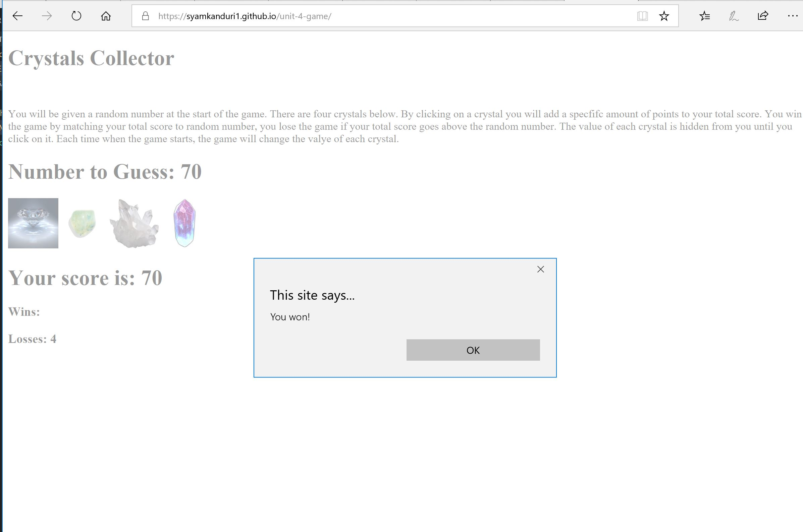

# CrystalsCollector Game

<!-- Put the name of the project after the # -->
<!-- the # means h1  -->
# Homework # 4 - CrystalsCollector Game

<!-- Put a description of what the project is -->
To develop a small game using javascript, jQuery, css and html. 

# Link to deployed site
<!-- make a link to the deployed site --> 
<!-- [What the user will see](the link to the deployed site) -->
[my fourth homework](https://syamkanduri1.github.io/unit-4-game/)


# Images
<!-- take a picture of the image and add it into the readme  -->
<!--  -->



# technology used
<!-- make a list of technology used -->
<!-- what you used for this web app, like html css -->

html, css, jQuery, javascript
<!-- 
1. First ordered list item
2. Another item
⋅⋅* Unordered sub-list. 
1. Actual numbers don't matter, just that it's a number
⋅⋅1. Ordered sub-list
4. And another item. 
-->


# code snippets
<!-- put snippets of code inside ``` ``` so it will look like code -->
<!-- if you want to put blockquotes use a > -->

```
            Added few additional lines of code to the 12-CrystalExample (day-4) and modularized the code slightly to achieve desired functionality...
            if (counter === randomNumber) {
                alert("You won!");
                numWins++;
                $("#number-wins").text(numWins);
                counter = 0;  
            }
            else if (counter >= randomNumber) {
                alert("You lost!");
                numLosses++;
                $("#number-losses").text(numLosses);
                counter = 0;
            }
            if(counter === 0){
                crystals.empty();
                populateImagesAndNumbers();
            }

```


# Learning points
<!-- Learning points where you would write what you thought was helpful -->
There are lot of crystal images on Web!

# Author 
Syam Kanduri

# License
Standard MIT License